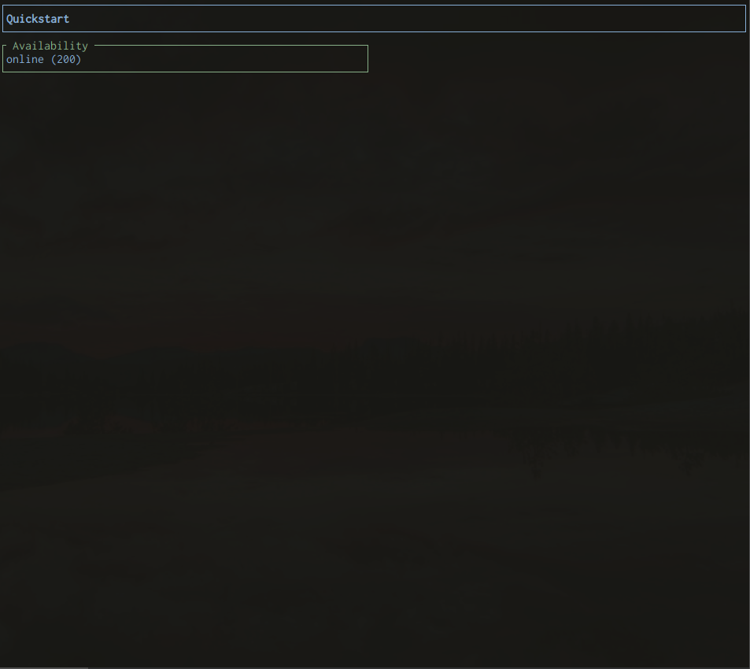
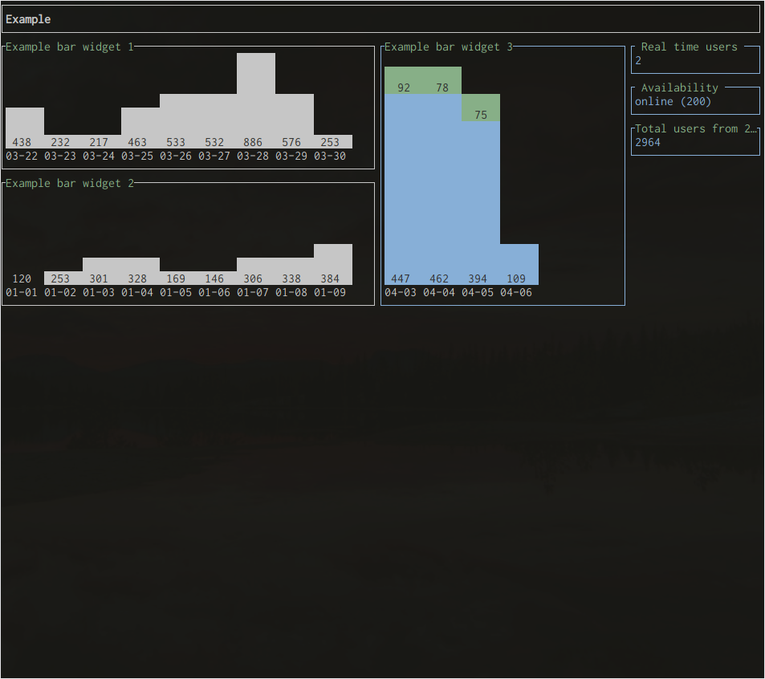
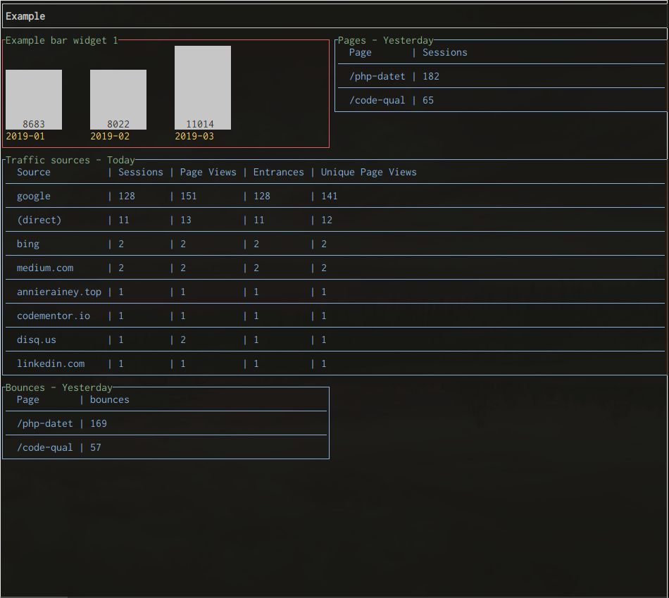
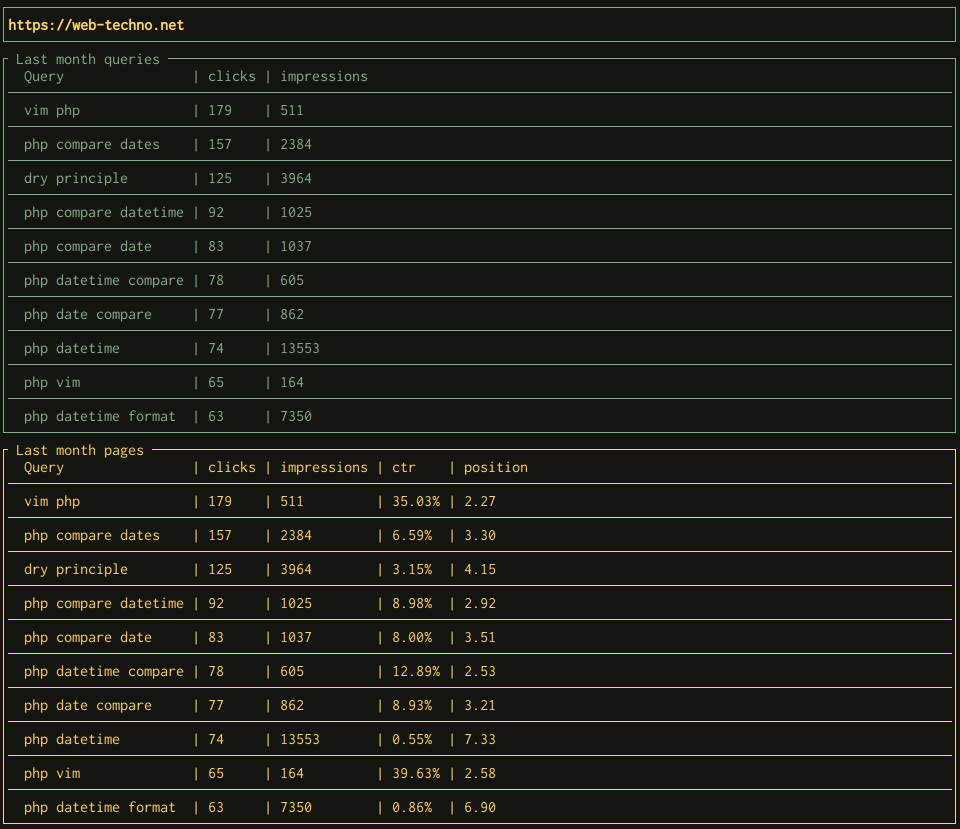
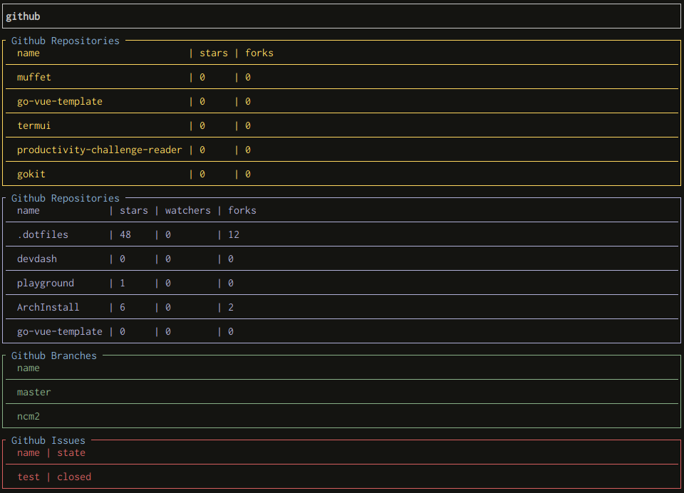
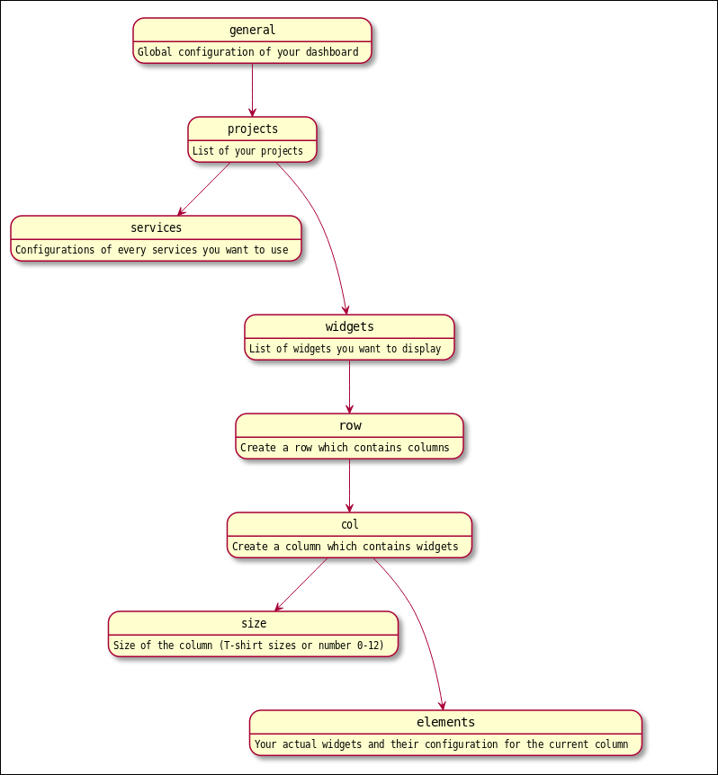

DevDash terminal dashboard, for developers who want the most up-to-date data they need about their projects, at one place.

# Why using DevDash?

* All the metrics you specifically need, at one place.
* Pull data from Github, Google Analytics or Google Search Console. More services to come!
* Unlimited amount of different dashboards with different configurations.
* Widgets' data refreshed automatically.
* A huge amount of flexibility compared to other terminal dashboards:
  * Choose the widgets you want.
  * Place your widgets where you want.
  * Choose the color, the data and a lot of other things for each widget.
* It's in the terminal so it's cool!

# Menu

* [Installation](#installation)
* [Getting Started](#getting-started)
* [Authorization and permissions](#authorization-and-permissions)
* [Configuration examples](#configuration-examples)
* [Structure of the config file](#structure-of-the-config-file)
* [Widget types](#widget-types)
* [Configuration reference](#configuration-reference)
* [General references](#general-references)
* [Acknowledgement](#acknowledgement)
* [Contribute](#contribute)
* [Licence](#licence)

# Installation

## Linux

You can simply grab the [latest released binary file](https://github.com/Phantas0s/devdash/releases/download/0.1.0/devdash) and put it wherever you want.

Here's a simple way to download and put DevDash in `/usr/local/bin`, which should be part of your path.

```shell
cd /usr/local/bin && sudo curl -LO https://github.com/Phantas0s/devdash/releases/download/0.1.0/devdash && sudo chmod 755 devdash && cd -
```

## Manual installation

You need go installed to compile DevDash.

Then, simply run `go get -u github.com/Phantas0s/devdash/cmd/devdash/`

# Getting started

For now, you can access four APIs (services) via DevDash:

* Google Analytics (ga)
* Google Search Console (gsc)
* A monitoring service (mon)
* Github (github)

To see DevDash in action and get familiar with the config file, you can easily configure the monitoring service:



Here the config to create this (very simple) dashboard:

```yml
---
general:
  refresh: 600
  keys:
    quit: "C-c"

projects:
  - name: Quickstart
    services:
      monitor:
        address: "https://www.web-techno.net"
    widgets:
      - row:
          - col:
              size: "M"
              elements:
                - name: mon.box_availability
                  options:
                    border_color: green
```

You can: 

* Copy past the config in a new file (`monitoring.yml`, for example)
* Run DevDash: `devdash -config monitoring.yml`

Congratulation! You just created your first dashboard. DevDash will simply send a request every `600` seconds to `https://www.web-techno.net` and display the response's status code.

# Authorization and permissions

Some services need credentials and permissions for DevDash to pull the data into your shiny terminal. Following the detailed step by step tutorial to create these permissions:

## Github

1. Go to your Github account in your favorite browser
2. Click on your avatar (top right corner)
3. Click on "Settings"
4. Click on "Developer settings"
5. Click on "Personal access tokens"
6. You don't need to select any scope for DevDash, except if you want to read data from your private repositories.
7. Generate a **new token you will add in your DevDash configuration**.

## Google Analytics / Google Search Console

Obviously, you need to have a Google Analytics account or Google Search account to access these two services.

### Downloading the authorization JSON file 

1. Go to [https://console.developers.google.com/apis/api/webmasters.googleapis.com/credentials](Google APIs Credentials).
2. Select `Service account key`.
3. Create a new service account.
4. Select the role `Project -> Viewer` for a read access only.
5. Add a name.
6. Click on the button `create`.
7. Save the `Service account ID` somewhere. We will need it later.
8. Download the JSON file. **Its path need to be specified in the config of your DevDash dashboard.**

### Pulling data from Google Analytics

1. Go to your [Google Analytics account](https://search.google.com/search-console/users).
2. Click on `Admin` in the menu (last element of the menu)
3. Select the application you want to use with DevDash in the property column (just below the column name `property`).
4. Click on the `+` button and add a user.
5. Click on user management of the same column.
6. Enter the email address you saved before (the `Service account ID` of step 7, above).
7. Click on `View settings` on the `View` column and copy the `View ID` into your **DevDash configuration file**.

### Pulling data from Google Search Console

1. Go to your [Google Search Console account](https://search.google.com/search-console/)
2. Click the property you want to access with DevDash.
3. Click on `Settings` in the menu on the left.
4. Click on `Users and permissions` and add a user with the `Service Account ID` as email address (see step 7 of `Downloading the authorization JSON file` above).

# Configuration examples

You can click on each screenshot to see the config of these dashboards.

## Google Analytics

[](./example/ga-1.yml)
[](./example/ga-2.yml)

## Google Search Console

[](./example/gsc-1.yml)

## Git 

[](./example/git-1.yml)

## Real life dashboard

[](./example/mix-1.yml)

# Structure of the config file

Since a diagram is better than a wall of text, here we go:



# Widget types

There are three category of widgets:

* `box` - a single value in a box
* `bar` - a bar diagram with multiple values overtime (dates on the x-axis)
* `table` - data in a table

# Configuration reference

## Monitoring

### Service configuration

```yml
    services:
      monitor:
        address: "https://www.my-website.net"
```

### Widgets available

| Name                     | Description                                                                                                        |
| ------------------------ | ------------------------------------------------------------------------------------------------------------------ |
| mon.box_availability     | Send an HTTP request to the address specified in he service configuration and display the response's status code   |

##### Data Options

None.

##### Display Options

| Name           | Description    | Default value             | Examples                                  |
| -------------- | -------------- | ------------------------- | ----------------------------------------- |
| title          | Title          | Depending on the widget   | ` Users `                                 |
| height         | Height         | `10`                      | `5`                                       |
| title_color    | Title color    | `Default color`           | `yellow`, `red` (see [colors](#colors))   |
| border_color   | Border color   | `Default color`           | `yellow`, `red` (see [colors](#colors))   |
| text_color     | Text color     | `Default color`           | `yellow`, `red` (see [colors](#colors))   |

## Github

### Service configuration

```yml
    services:
      github:
        token: myToken
        owner: myName
        repository: myCoolRepo
```

The repository is not mandatory. However, you will need to precise the repository for each widget fetching data for a specific one.

### Widgets available

| Name                          | Description                                                                      |
| ----------------------------- | -------------------------------------------------------------------------------- |
| github.box_stars              | Number of stars of a precise repository                                          |
| github.box_watchers           | Number of watchers of a precise repository                                       |
| github.box_open_issues        | Number of open issues of a precise repository                                    |
| github.table_branches         | All branches of a precise repository                                             |
| github.table_issues           | All issues (and their states) of a precise repository                            |
| github.table_repositories     | Table of all repositories with count different information (see `metrics` option)|

### Widget Options

#### Table Widgets

##### Data Options

| Name            | Description                    | Default value                        | Examples                                          | Not available for                                  |
| --------------- | ------------------------------ | ------------------------------------ | ------------------------------------------------- | -------------------------------------------------- |
| row_limit       | Limit the number of rows       | 5                                    | 5, 100                                            |                                                    |
| order           | Order of the list              | `updated`                            | `created`, `updated`, `pushed`, `full_name`       | `github.table_branches`, `github.table_issues`     |
| metrics         | Column display                 | `stars,watchers,forks,open_issues`   | `stars,forks`                                     | `github.table_branches`, `github.table_issues`     |

##### Display Options

| Name               | Description      | Default value                   | Examples                                      |
| ------------------ | ---------------- | ------------------------------- | --------------------------------------------- |
| title              | Title            | `Depending on the widget`       | `Users `                                      |
| title_color        | Title color      | `Default color`                 | `yellow`, `red` (see [colors](#colors))       |
| border_color       | Border color     | `Default color`                 | `yellow`, `red` (see [colors](#colors))       |
| text_color         | Text color       | `Default color`                 | `yellow`, `red` (see [colors](#colors))       |

## Google Analytics

### Service configuration

```yml
    services:
      google_analytics:
        keyfile: goanalytics-abc123.json
        view_id: 456789123
```

### Widgets available

| Name                           | Description                                                              |
| ------------------------------ | ------------------------------------------------------------------------ |
| ga.box_real_time               | Number of users currently on the website                                 |
| ga.box_total                   | Total of any metric on a given time period                               |
| ga.bar_sessions                | Count of sessions                                                        |
| ga.bar_bounces                 | Count of bounce sessions                                                 |
| ga.bar_users                   | Count of users                                                           |
| ga.bar_returning               | Count of returning users                                                 |
| ga.bar_pages                   | Count of sessions (or any other metric like users) on specific page(s)   |
| ga.bar                         | Count of theoretically any metrics from Google Analytics                 |
| ga.bar_new_returning           | Count of new and returning users                                         |
| ga.table_pages                 | Display chosen data about pages                                          |
| ga.table_traffic_sources       | Display Data about traffic sources                                       |
| ga.table                       | Display theoretically any metrics from Google Analytics                  |

### Widget Options

#### Bar Widgets

##### Data Options

| Name            | Description                                                                   | Default value     | Examples                                 | Not available for                                        |
| --------------- | ----------------------------------------------------------------------------- | ----------------- | ---------------------------------------- | -------------------------------------------------------- |
| start_date      | Start date of time period                                                     | `7_days_ago`      | `2018-01-01`, `2_weeks_ago`              |                                                          |
| end_date        | End date of time period                                                       | `today`           | `2018-01-31`, `2_weeks_ago`              |                                                          |
| time_period     | Time period represented by a bar                                              | `days`            | `days`, `months`, `years`                |                                                          |
| metric          | Google analytics metric                                                       | `sessions`        | `page_views`, `bounces`, `entrances`     | `ga.bar_pages`, `ga.bar_returning`                       |
| dimensions      | Google analytics dimensions. Multiple value possible separated with a comma   |                   | `page_path`, `user_types`                | `ga.bar_pages`, `ga.bar_bounces`, `ga.bar_returning`     |
| filters         | Query filter (prefix `-` to exclude)                                          |                   | `value`, `-value`                        |                                                          |

##### Display Options

| Name           | Description                 | Default value               | Examples                                  |
| -------------- | --------------------------- | --------------------------- | ----------------------------------------- |
| title          | Title                       | `Depending on the widget`   | `Users `                                  |
| border_color   | Border color                | `Default color`             | `yellow`, `red` (see [colors](#colors))   |
| height         | Height                      | `10`                        | `5`                                       |
| title_color    | Title color                 | `Default color`             | `yellow`, `red` (see [colors](#colors))   |
| text_color     | Text color                  | `Default color`             | `yellow`, `red` (see [colors](#colors))   |
| num_color      | Color of numerical data     | `Default color`             | `yellow`, `red` (see [colors](#colors))   |
| bar_color      | Bar color                   | `Default color`             | `yellow`, `red` (see [colors](#colors))   |
| bar_gap        | Gap size between the bars   | `0`                         | `5`, `10`                                 |
| bar_width      | Bar width                   | `6`                         | `5`, `10`                                 |

#### Table widgets

##### Data Options

| Name              | Description                                                                 | Default value                                       | Examples                                       | Not used by                  |
| ----------------- | --------------------------------------------------------------------------- | --------------------------------------------------- | ---------------------------------------------- | ---------------------------- |
| start_date        | Start date of time period                                                   | `7_days_ago`                                        | `2018-01-01`, `2_weeks_ago`                    |                              |
| end_date          | End date of time period                                                     | `today`                                             | `2018-01-31`, `2_weeks_ago`                    |                              |
| metrics           | Google analytics metrics. Multiple values possible separated with a comma   | `sessions,page_views,entrances,unique_page_views`   | `bounces,sessions`, `entrances`                |                              |
| dimension         | Google analytics dimension                                                  | `page_path`                                         | `2018-01-31`, `2_weeks_ago`                    | `ga.table_traffic_sources`   |
| orders            | Order of the result. Multiple value possible separated with a comma         | `sessions desc`                                     | `sessions desc,page_views asc`. `page_views`   |                              |
| filters           | Query filter (prefix `-` to exclude)                                        |                                                     | `value`, `-value`                              |                              |
| row_limit         | Limit the number of rows                                                    | 5                                                   | 5, 100                                         |                              |
| character_limit   | Limit the number of characters of the dimension column                      | 1000                                                | 100, 200                                       |                              |

##### Display Options

| Name             | Description    | Default value                 | Examples                                    |
| ---------------- | -------------- | ----------------------------- | ------------------------------------------- |
| title            | Title          | `Depending on the widget`     | `Users `                                    |
| title_color      | Title color    | `Default color`               | `yellow`, `red` (see [colors](#colors))     |
| border_color     | Border color   | `Default color`               | `yellow`, `red` (see [colors](#colors))     |
| text_color       | Text color     | `Default color`               | `yellow`, `red` (see [colors](#colors))     |

#### Box widgets

##### Data Options

| Name             | Description                       | Default value   | Examples                               |
| ---------------- | --------------------------------- | --------------- | -------------------------------------- |
| start_date       | Start date of time period         | `7_days_ago`    | `2018-01-01`, `2_weeks_ago`            |
| end_date         | End date of time period           | `today`         | `2018-01-31`, `2_weeks_ago`            |
| metric           | Google analytics' metric          | `sessions`      | `page_views`, `bounces`, `entrances`   |

##### Display Options

| Name               | Description        | Default value                       | Examples                                  |
| ------------------ | ------------------ | ----------------------------------- | ----------------------------------------- |
| title              | Title              | `Depending on the widget`           | `Users `                                  |
| height             | Height             | `10`                                | `5`                                       |
| title_color        | Title color        | `Default color`                     | `yellow`, `red` (see [colors](#colors))   |
| border_color       | Border color       | `Default color`                     | `yellow`, `red` (see [colors](#colors))   |
| text_color         | Text color         | `Default color`                     | `yellow`, `red` (see [colors](#colors))   |

## Google Search Console

### Service configuration

```yml
    services:
      google_search_console:
        keyfile: goanalytics-abc123.json
```

### Widgets available

| Name                | Description                                                                             |
| ------------------- | --------------------------------------------------------------------------------------- |
| gsc.table_pages     | Display clicks, impressions, ctr, position for pages                                    |
| gsc.table_queries   | Display clicks, impressions, ctr, position for queries                                  |
| ga.table            | Display theoretically any dimension from Google Search Console on a given time period   |

### Widget Options

#### Table widgets

##### Data Options

| Name              | Description                                                                       | Default value                       | Examples                                       | Not used by         |
| ----------------- | --------------------------------------------------------------------------------- | ----------------------------------- | ---------------------------------------------- | ------------------- |
| start_date        | Start date of time period                                                         | `7_days_ago`                        | `2018-01-01`, `2_weeks_ago`                    |                     |
| end_date          | End date of time period                                                           | `today`                             | `2018-01-31`, `2_weeks_ago`                    |                     |
| metrics           | Google Search Console metrics (multiple values possible separated with comma)     | `clicks,impressions,ctr,position`   | `query`, `page`                                | `gsc.table_pages`   |
| dimension         | Google Search Console dimension (multiple values possible separated with comma)   | `quert`,                            | `2018-01-31`, `2_weeks_ago`                    |                     |
| orders            | Order of the result (multiple values possible separated with comma)               | `sessions desc`                     | `sessions desc,page_views asc`. `page_views`   |                     |
| filters           | Filter the default dimension (prefix `-` to exclude)                              |                                     | `value`, `-super value`                        |                     |
| row_limit         | Limit the number of rows                                                          | 5                                   | 5, 100                                         |                     |
| character_limit   | Limit the number of characters for the first column (dimension)                   | 1000                                | 100, 200                                       |                     |

##### Display Options

| Name             | Description      | Default value                 | Examples                                  |
| ---------------- | ---------------- | ----------------------------- | ----------------------------------------- |
| title            | Title            | `Depending on the widget`     | `Users `                                  |
| border_color     | Border color     | `Default color`               | `yellow`, `red` (see [colors](#colors))   |
| text_color       | text_color       | `Default color`               | `yellow`, `red` (see [colors](#colors))   |

# General references

## Options values

### Colors

The list of colors you can use in DevDash configuration.

Their display will depend of the colors you've configured for your terminal.

| Name    |
|---------|
| default |
| black   |
| red     |
| green   |
| yellow  |
| blue    |
| magenta |
| cyan    |
| white   |

### Size

DevDash is based on a 12 columns grid.

You can indicate the width of a widget in number of column (1 to 12), or using the equivalent t-shirt size as described below:

| Name   | Number of columns   |
| ------ | ------------------- |
| xxs    | 1                   |
| xs     | 2                   |
| s      | 4                   |
| m      | 6                   |
| l      | 8                   |
| xl     | 10                  |
| xxl    | 12                  |

### Time range

The `start_date` and `end_date` options accept dates following this format: `2016-01-02`.

You can use as well aliases relative to the present day.

The same alias can be a different date depending if it's used for the `start_date` or the `end_date` option. 

You can replace every `x` in the names by numerical values.

| Name           | start_date                                           | end_date                                            |
| -------------- | ---------------------------------------------------- | --------------------------------------------------- |
| today          | current day                                          | current day                                         |
| yesterday      | yesterday                                            | yesterday                                           |
| x_days_ago     | `x`th day before the current day                     | `x`th day before the current day                    |
|                |                                                      |                                                     |
| this_week      | first day of the actual week                         | last day of the actual week                         |
| last_week      | first day of the last week                           | last day of the last week                           |
| x_weeks_ago    | first day of the `x`th week before the current week  | last day of the `x`th week before the current week  |
|                |                                                      |                                                     |
| this_month     | first day of the actual month                        | last day of the actual month                        |
| last_month     | first day of the last month                          | last day of the last month                          |
| x_months_ago   | first day the `x`th month before the current month   | last day the `x`th month before the current month   |
|                |                                                      |                                                     |
| this_year      | first day of the actual year                         | last day of the actual year                         |
| last_year      | first day of the last year                           | last day of the last year                           |
| x_years_ago    | first day the `x`th year before the current year     | last day the `x`th year before the current year     |

# Acknowledgement

Thanks to [MariaLetta](https://github.com/MariaLetta/free-gophers-pack) for the awesome and beautiful Gopher pack she made! I used it for my logo on top.

# Contribute

First of all, thanks a lot if you want to contribute to DevDash!

I think the ["talk, then code"](https://dave.cheney.net/tag/contributing) practice is pretty good to avoid misunderstandings and hours of work for nothing.

Therefore:

"Every new feature or bug fix should be discussed with the maintainer(s) of the project before work commences. It’s fine to experiment privately, but do not send a change without discussing it first."

# Licence

[Apache Licence 2.0](https://choosealicense.com/licenses/apache-2.0/)
