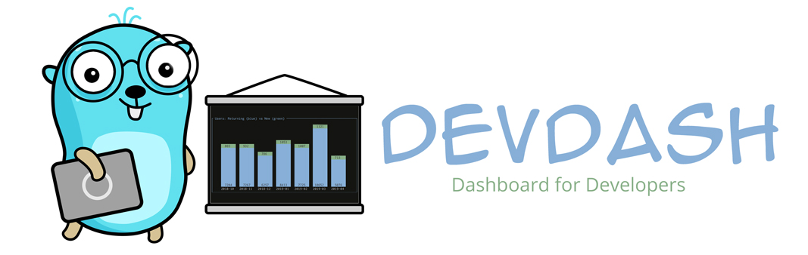
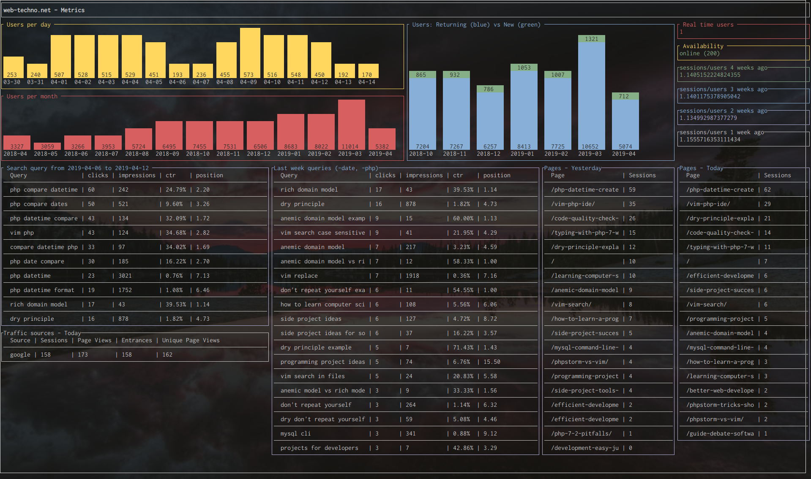
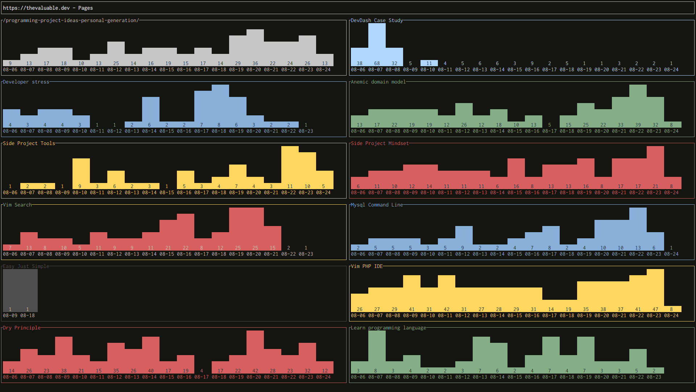
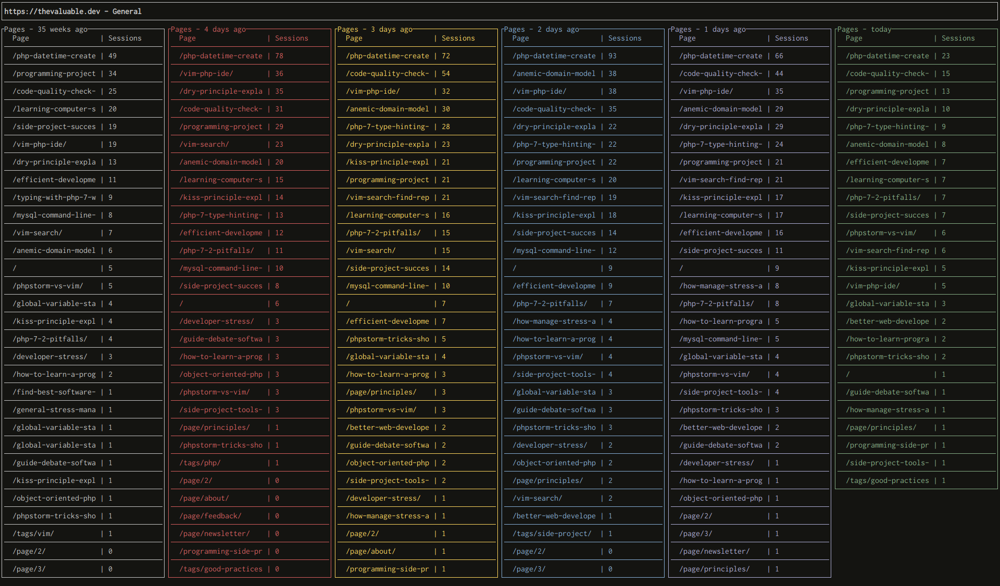
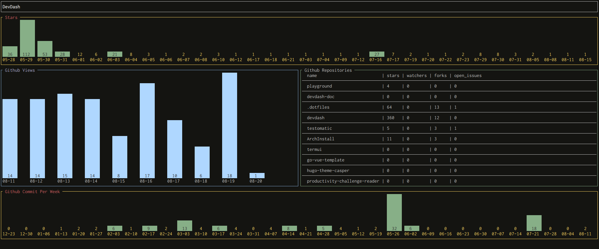

 [](https://www.codacy.com/app/Phantas0s/devdash?utm_source=github.com&amp;utm_medium=referral&amp;utm_content=Phantas0s/devdash&amp;utm_campaign=Badge_Grade)  [](https://goreportcard.com/report/github.com/Phantas0s/devdash) [](https://hitsofcode.com/view/github/phantas0s/devdash) [](https://opensource.org/licenses/Apache-2.0) 
 
[](https://twitter.com/intent/tweet?text=DevDash%20-%20Highly%20Configurable%20Terminal%20Dashboard%20For%20Developers:&url=https%3A%2F%2Fgithub.com%2Fphantas0s%2Fdevdash&hashtags=developers,dashboard,terminal,CLI,golang)

DevDash is a highly configurable terminal dashboard for developers and creators who want to choose and display the most up-to-date metrics they need, at one place.

[](https://raw.githubusercontent.com/Phantas0s/devdash/master/example/img/mix-1.png)

## Why using DevDash?

* Pull and display the data in nice widgets using YAML (or JSON) config files, from: 
    * Your own computer. From your own scripts and command lines too!
    * A remote computer via SSH.
    * Github.
    * Travis.
    * Google Analytics.
    * Google Search Console.
    * Feedly.

* A lot of flexibility compared to other terminal dashboards:
  * Choose the widgets you want.
  * Place your widgets where you want.
  * Choose the data you want to display, the colors you want to use, and a lot of other things for each widget.
  * Don't want to personalize everything? Don't overwrite the defaults, then.
* Unlimited amount of different dashboards with different configurations.
* Data refreshed automatically via time ticks, or via a keyboard shortcut (Ctrl + r by default).

## Video

You can watch a [quick demo on Youtube](https://www.youtube.com/watch?v=aYQVJRuBrC8&feature=youtu.be).

## Menu

* [Installation](#installation)
* [Getting Started](#getting-started)
* [Documentation](#documentation)
* [Acknowledgement](#acknowledgement)
* [Contribute](#contribute)
* [Licence](#licence)
* [Making of](#Making-of)
* [Showcase](#showcase)

## Installation

You can simply grab the [latest released binary file](https://github.com/Phantas0s/devdash/releases/latest) and download the version you need, depending on your OS.

### Linux script

To download DevDash in `/usr/local/bin`, run the following in a terminal:

```shell
curl -LO https://raw.githubusercontent.com/Phantas0s/devdash/master/install/linux.sh | bash
```

### Manual installation

You need to: 
1. Clone this repository 
2. In your terminal, run in the root directory of the project `go build devdash.go`

## Getting started

* If you run `devdash` without giving a dashboard configuration, it will:
    * Create a config for the default dashboard (`default.yml`) in `$XDG_CONFIG_HOME/devdash`.
    * Display this default dashboard.
* You have [many examples here](https://thedevdash.com/getting-started/examples/) to modify this default dashboard or create your own from scratch.
* Each dashboard need a config file. To pass this config file to DevDash, you need to use the option `-c`. For example: `devdash -c default`.
    * If you only pass the filename of the dashboard's config, it needs to be in the working directory or in `$XDG_CONFIG_HOME/devdash`.
    * You can also pass a relative or absolute path to the config.
    * The dashboard's config can be written in YAML, JSON, or TOML.

The value of `$XDG_CONFIG_HOME` depends of your OS. Here are the defaults (if you didn't modify it):

* **Unix systems**: `~/.config`
* **macOS**: `~/Library/Application Support`
* **Windows**: `%LOCALAPPDATA%`


## Documentation

[The complete DevDash documentation is here](https://thedevdash.com)

You'll find in there:

* [Installation / getting started](https://thedevdash.com/getting-started/installation/)
* [Simple examples](https://thedevdash.com/getting-started/examples/)
* [Real-life use cases](https://thedevdash.com/getting-started/use-cases/devdash/)
* [Complete reference of dashboard's config](https://thedevdash.com/reference/)

If you want to see even more real life examples, I've [all of them in my dotfiles](https://github.com/Phantas0s/.dotfiles/tree/master/devdash).

## Acknowledgement

Thanks to [MariaLetta](https://github.com/MariaLetta/free-gophers-pack) for the awesome and beautiful Gopher pack! I used it for my logo on top.

DevDash was inspired from other open source projects:

* [wtf](https://github.com/wtfutil/wtf)
* [tdash](https://github.com/jessfraz/tdash)

## Bugs and Ideas

If you have any idea to improve DevDash or if you see any bug, please open an issue.

## Contribute

Thanks a lot if you want to contribute to DevDash!

If you want to implement a new feature, let's speak about it first (by opening an issue) and decide if it fits DevDash scope.

## Making Of

For anybody interested how I managed to develop DevDash on side of a full time job, and how I organized my time and kept my motivation, [I wrote an article about that on my blog](https://thevaluable.dev/programming-side-project-example-devdash/).

## Licence

[Apache Licence 2.0](https://choosealicense.com/licenses/apache-2.0/)

## Showcase


-------

-------

